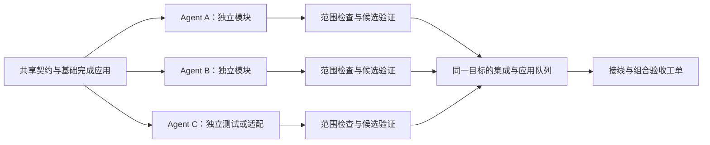

# Lachesis 执行可靠性与多 Agent 并发修复方案

日期：2026-09-24。本文件保留调查时的证据与修复设计。2026-09-25 已完成程序修复及本地验收，见 [程序修复验收记录](program-repair-acceptance-2026-09-25.md)；原演练未重跑，原运行数据和全局权限配置未修改。下文“现有”“目前”描述调查时状态，实施结果以验收记录为准。

目标：让已配置的 Agent 能同时推进真正独立的工单；某个运行失败时，其他可执行工作继续；返工能拿到有效诊断，未完成成果可安全接续，最终交付仍通过范围检查、集成验证和显式应用。

## 已确认的原因

本次读取 `.lachesis/reading-ledger-real-run/data/lachesis.sqlite`：25 张工单，15 张已应用，46 次 Run（24 completed、3 failed、19 interrupted）。13 号交付已接收但集成失败、未应用，14–22 blocked。数据库最后事件为 2026-09-24 20:08:13.923（Asia/Shanghai）。这些是该隔离演练的数据，不代表所有 Lachesis 项目。

40 次 Run 有完整 started_at/ended_at，严格区间比较没有重叠。另 6 次 interrupted 缺 started_at。started_at 在进入 running 时记录，不能据此排除工作区准备阶段的短暂并发，但模型施工没有出现可观测的并行区间。

| 问题 | 证据与机制 | 责任边界 |
| --- | --- | --- |
| 主工单链人为串行 | `populate.mjs:58–64` 将 04–22 的 dependsOn 固定为前一个编号；`domain/service.ts:1322` 要求有代码的前置交付完成应用 | 演练拆分错误。20 多张工单不应自动等于20 多个串行步骤 |
| 控制程序也按编号等待 | `drive.mjs:122` 逐张等待、接收、集成、应用、复测，再处理下一张 | 演练驱动缺少同时管理多个 Run 的能力；单改调度上限无效 |
| 引擎有并发，但配置与调度不完整 | `supervisor.ts:12,250` 有4个槽位，异步 execute；每次 tick 按固定 Profile 顺序各领取一张 | 没有可配置容量、充分填槽、公平性与等待原因。固定顺序在饱和时有饥饿风险，尚未实测该风险 |
| 重复执行环境故障 | 38 个 Run 出现 SetNamedSecurityInfoW / Win32 5，440 条相关事件（非440次独立故障）；涉及MiniMax 16、Step 12、MiMo 10个Run | 故障在dsh启动工具命令前设置Windows ACL的阶段，与单个模型无关；历史执行令牌仍需复现。Lachesis未将反复环境失败转成明确阻塞 |
| 诊断被截坏 | `workspace/verify.ts:28` 只取输出前8000字符；`drive.mjs:168` 再取这段末尾2400字符 | 产品与驱动共同丢失错误上下文。13号两份失败诊断均在普通测试输出中间截断 |
| 超时成果没有产品化恢复 | 11号8个文件由 `drive.mjs:29–79` 按固定 Run ID/hash 注入新 Run | 人工补救有记录，不能当作内置恢复能力 |
| 收尾导致后续 Run 中断 | 应用后自动释放依赖，驱动退出又关闭服务；08、11、13有相关历史记录 | 缺少独立的派发暂停、排空与客户端生命周期 |
| 扩大并发存在快照一致性缺口 | `supervisor.ts:292` 的 prepareRun 不经过 `application.ts:91` 的项目队列；文件项目逐文件复制目标 | 新工作副本可能遇上应用中途状态。属于源码发现的竞争窗口，本次未故障注入复现 |
| 交付审查过度依赖测试 | 探针文件曾被应用后再人工清理；驱动通过后固定评分4分 | 演练缺少明确文件范围验收；评分不能代替证据 |

“同一 Profile 只能跑一个”不是现有限制。领域层允许同 Profile 同时领取不同工单，唯一活跃约束落在 issue_id。Profile 目前是模型与行为配置；Run 才是具体执行实例。

07号返工说明迟到的问题已修复：`supervisor.ts:324–331` 将开工前已有评论加入首轮提示。保留回归检查，不再把它列作未修复问题。

## 目标工作方式

保留本机单服务、SQLite、每 Run 独立工作区、冻结交付与三方合并。现有架构足以支持多进程 Agent，无需新增消息中间件或通用工作流服务。

Agent 写各自工作区，可以同时运行。同一目标的快照、集成与应用通过共同协调器；不同目标可以独立推进。应用等待操作者确认时不持有目标锁。发生真正的代码依赖时等待已应用成果，不能为制造并发而取消依赖。

## 修复内容与设计决定

### 1. 先让每个工人能执行和自检

安装的dsh Windows沙箱实现给目录添加权限项和Low完整性标签；其grantWrite注释明确要求调用者拥有目录且具有WRITE_OWNER，只有所有者隐含的WRITE_DAC不够。本次只读核查中，当前执行身份为CodexSandboxOnline，保留的演练目录由它拥有，但CodexSandboxUsers继承权限是Modify。这与拒绝修改安全描述符的现象吻合：外层托管沙箱允许改文件，内层dsh却还需要调整目录安全信息。

因此，“嵌套沙箱权限不兼容”是有源码和当前ACL支持的首要解释，不能写成每个历史Run都已确定的根因：原始部分work目录已清理，历史服务令牌也未取证。`allow-once`只答复工具许可，不能增加Windows令牌权限。dsh已有Windows功能探针使用read-only和zero grants，不执行ACL修改，因此通过该探针也不能证明工作区写模式能用。

安装源码位置：`node_modules/.pnpm/@deepseek-ai+dsh-sandbox-wi_1626bf468dbbf41333f4672ed6a9c7b0/node_modules/@deepseek-ai/dsh-sandbox-windows-acl/lib/types-DxezulnA.js:578–604`；`node_modules/.pnpm/@deepseek-ai+dsh-sandbox-lo_7e9850ebf3bad432eb4dbd196094af8f/node_modules/@deepseek-ai/dsh-sandbox-local/lib/index.js:137–141,392–407`。路径是本次安装证据，升级后应按包版本重新定位。

在派发正式任务前验证实际 dsh 工具路径：同一运行身份、同一沙箱配置、同类工作目录，执行固定无害命令，并在工作区内写入、读回、删除唯一探针。文件工具和命令工具分别验证。宿主 Node 能运行、ACP 能连接、模型能说“成功”，都不能代替这项检查。

首选复用安装运行时的工具执行接口实现确定性检查，不付费请求模型来判断自己是否能执行。若上游没有稳定接口，提供专门的诊断入口或受控实机工具冒烟，并把这项上游依赖明确纳入实施工作；不得用另一条更宽权限的宿主路径冒充成功。

预检结果关联运行时版本、配置指纹和执行环境；每个新工作目录仍检查目录访问能力。不可只按模型缓存结果，ACL问题可能与目录和父进程有关。

将错误区分为环境不可用、供应商暂时失败、模型交付未通过、集成冲突、进程退出未确认。确定性的权限拒绝不自动重试；暂时网络故障可以有限退避，保留次数、原因与恢复动作。退出未确认继续使用现有 recovery_required 防护。

环境阻塞必须指出影响范围：单工作区、Profile/共享路由，或整个执行后端。只暂停受影响的派发，不把无关 Agent 全部停掉。不得自动升级到 full access、修改全局 ACL 或扩展项目目录访问。

Windows 根因定位的实施检查：记录失败 API/目录/工具类型/执行身份，在相同安全边界下最小复现；比较目录所有者、继承 ACL、父进程令牌及 dsh 沙箱初始化顺序。独立宿主部署若用于对照，必须维持相同隔离约束；当前拒绝不能通过换入口规避。修改系统权限或全局配置需另行授权。

修复分支由复现决定：若合法独立服务身份下同样失败，修复或升级dsh的目录授权实现；若仅在外层托管沙箱内失败，Lachesis明确报告不兼容的启动环境，并提供经授权、仍启用dsh隔离的本机服务启动方式。两种情况下都重跑实际工具调用；不以关闭沙箱作为产品修复。

演练权限答复另行修正：当前permission-policy仅检查少数字段便默认allow-once，不能用workdir推断shell命令的全部访问。请求与toolCallId直接绑定，文件操作解析真实路径并拒绝链接越界；对可预先描述的验证程序和参数作明确授权，无法判定的命令留给操作者。实际权限边界仍由运行时沙箱执行，不能声称字符串路径检查能约束任意shell命令。

### 2. 重建反馈闭环

验证产物保存命令、工作目录、退出码、超时原因、运行时间、输出产物引用和失败摘要。输出有总量上限；超限必须标记，并优先保留失败详情及首尾上下文，不能再静默留下前半段通过测试。

对本次 Node 测试使用可解析报告，提取失败测试名称、文件位置、断言差异和栈。通用命令仍保存脱敏的有界日志；不假设所有项目都使用 Node。当前敏感流文本保护必须保留，新增日志读取沿用项目鉴权，不泄漏环境密钥。

返工首轮输入固定包含：原工单、选中的冻结交付、诊断摘要与可读取日志、修改范围、精确验收命令。反馈必须能在该 Run 中实际读到，不能只给一个无法访问的宿主路径。多条待送达指令可合并为一次反馈，避免一次纠错触发多轮完整施工。

同一失败指纹反复出现且无实质变化时，转入需要诊断的状态；不能只“再试一次”。当代码、输入或环境发生变化时，可以继续定向修复，不设置无条件的固定返工轮数作为完成边界。

### 3. 开放可理解的并发容量

把硬编码4改成持久设置，默认保留4以维持旧行为；支持用户配置更高容量，具体实机容量由资源与路由验证决定，不把默认值当作上限。

容量采用简单三项：全局上限、Profile上限，以及多个Profile共享上游时的provider容量。未设置Profile/provider限制时受全局限制。providerRef相同可共享配额，但不推断OCG内部上游映射；如多个引用共享物理额度，需显式指定同一容量组。暂不建设通用层级策略系统。

领取在现有SQLite事务中完成，容量检查和创建Run不可分离。starting、running、needs_input、cancelling以及仍无法确认退出的资源都要计入占用；数据库计数与监督器活动句柄需核对，不能在状态变更但进程仍存活时提前释放。

调度器按项目与Profile轮转，为就绪工单填满可用槽位；一轮没有可领取项就退出，避免忙循环。保留按创建时间的工单顺序，不引入未经需要证明的优先级系统。require保持精确模型选择；auto也需公平选择，不能总让排序靠前的Profile拿走任务。全局容量、指定Profile、共享路由、依赖、暂停、环境阻塞统一产生可解释的等待原因。

一张工单失败只阻塞它的依赖后代，其他就绪工单继续。不通过启动多个Lachesis服务来获取并发。

### 4. 把真实依赖和文件分工做进产品

修正演练：不再用 previousNo 生成 dependsOn。每张工单声明必需的前置成果；能读相同已应用基线的模块任务设为兄弟节点。共享接口先以小工单确定并应用，然后各实现并行，最后设置一个接线/组合验证工单。

新增结构化写入范围和共享只读范围，用于派发冲突提示与冻结后的diff验收。同一批次将 app.js、统一样式入口、数据库迁移和依赖清单等共享文件交给明确的接线工单；不能让全部Agent都自由改同一入口文件。范围约束是调度和验收机制，不宣称是操作系统安全沙箱。确需扩大范围时留下明确修订。

对有明确范围的并行任务，超出范围的交付不能自动放行；可返工或明确审阅接受范围变更。无范围的历史工单继续可读，显示“范围未限定”，不静默改写历史。

当前API只能创建依赖，不能修改。新增只允许未启动工单（queued/blocked且无Run）的编辑/重规划操作，使用expectedIssueVersion、环检测、同项目校验和审计事件；事务内与认领竞争。已有Run的工单通过明确的新工单接续，不原地改写其历史任务。

首次修改现有演练图时，暂停新派发，保留01–12及23–25的成功记录、13的失败交付，再显式修订未启动的14–22。不得清库重跑或把失败历史改成通过。

### 5. 独立控制派发、客户端和服务生命周期

服务保持运行，演练驱动改为使用HTTP/MCP的事件客户端。关闭浏览器、脚本退出、达到某个编号，都不再等于关闭全部ACP进程。

项目提供“暂停新任务”“继续派发”和“等待当前任务结束”；取消某个Run仍是独立操作。暂停状态跨重启保存。等待当前任务结束包含needs_input，界面应显示仍待回答的问题，不能假装已经排空。进程未确认退出时继续保留恢复状态和容量占用。

先暂停再完成当前批次，可避免应用后自动启动下一张又被收尾脚本杀掉。批次完成条件按明确工单集合判断，不依赖for循环的最后编号。

### 6. 保证并发施工后的集成正确

把目标协调从application私有队列提取为服务内共用组件，覆盖目标快照、集成、应用。锁以规范化物理目标身份管理，处理大小写、路径别名；同一服务中重复或相互包含的目标目录注册应拒绝或明确归为同一受控目标，不能按两个projectId各自上锁。Git还需覆盖共享仓库元数据操作。

首版保守串行同目标快照/集成/应用；以后只有测得锁等待成为瓶颈，才缩小锁范围。模型运行与冻结自己的隔离目录不持有目标锁。不同目标不互相阻塞。

进程内锁只能协调本服务，不能阻止编辑器或另一个dataRoot的服务修改目录。文件项目校验完整受管文件清单与哈希，要求“复制前目标 = 复制所得基线 = 复制后目标”，不一致则拒绝该快照并有限重试；创建基线时也防范链接替换。部署约束为一个物理目标只由一个Lachesis服务管理，不能声称普通目录具有文件系统级原子快照。外部同时编辑仍需检测与明确冲突处理。

两个交付可以从同一基线并行产生。A应用后，B基于当前目标重新三方合并和验证；B的Delivery不变，但新候选有新Application身份。旧候选的验收与应用授权不能迁移到新候选。普通目录需对完整受管目标建立验证版本标识，不能只比较被修改文件而忽略其他文件变化导致旧验证失效。

冲突交给定向集成修复，不让原Agent盲目重新实现。修复仍在隔离候选中进行。应用及失败恢复保持串行，失败不能覆盖其他已应用成果。评分保留人工判断，不再由测试通过固定写4分。

### 7. 将失败工作区接续变成明确能力

区分不可变的“未完成检查点”和“可验收交付”。超时/取消后只有确认整个进程范围退出，才能从残留工作区冻结检查点；记录原Run、项目、模型配置修订、原始基线、文件哈希和失败原因。

用户显式选择检查点后启动新Run。目标已变化时沿用原始共同基线作三方处理，冲突明确呈现，不能把旧文件直接覆盖到最新目标。检查点不能被issue.accept或application.apply直接消费。

同步调整recoverInterrupted：启动时不能仅把recovery_required改成interrupted/failed便视作退出已确认。只有取得足够的进程范围回收证据，才能释放相关占用并开放检查点接续；无法确认时保持阻塞并提供明确恢复动作。

优先复用现有产物库、freeze和seed基础设施，但类型和状态必须区分。删除drive里固定11号Run的注入逻辑前，用新流程完成等价恢复演练；失败目录在转换验证前保留。

### 8. 界面必须能解释“为什么这个Agent没有工作”

显示可用/已占用容量、每个Profile当前Run、就绪队列和阻塞原因。工单图中区分等前置应用、等容量、等输入、环境不可用、待验收和待集成；“已接收”旁同时显示“未应用/已应用”，无需为解决文案立即重写整个Issue状态机。

运行详情显示可读取的失败日志、返工输入、检查点来源；文件范围越界不能藏在日志里。暂停、继续、容量编辑和查看依赖均可用键盘操作，状态不能只靠颜色区分。API/MCP返回同一调度判定，避免界面和调度器各算一套。

## 实施批次与并行安排

以下是产品修复工作包，不是重新编号原25张演练工单。主负责人拥有共享契约、schema迁移、依赖清单、集成和最终验收；每个实现Agent拥有独立路径，必要时使用独立工作树。

| 批次 | 工作包 | 主要代码位置 | 并行与依赖 |
| --- | --- | --- | --- |
| A | A0 固定诊断、容量、派发与范围的数据契约；增量迁移入口 | contracts、domain/schema与migrate、API合约 | 主负责人先冻结契约与验收样例 |
| A | A1 复现并修复dsh工具路径的环境故障，接入预检与阻塞 | runtime、独立诊断脚本 | 与A2并行；必要时上游修复，不能仅隐藏错误 |
| A | A2 保存有界诊断产物、失败解析、返工首轮输入 | workspace/verify与产物库、supervisor反馈接线 | 与A1并行，supervisor由主负责人集成，避免双写 |
| B | B1 容量事务、公平派发、暂停/排空、未启动依赖编辑、范围契约 | domain、supervisor | 依赖A0；与B2/B3分目录推进 |
| B | B2 共用目标协调器、一致快照、过期候选重建 | workspace、server集成接线 | 主负责人统一server共享接线；依赖A0 |
| B | B3 容量与阻塞视图、依赖和范围编辑、暂停继续 | web、API客户端 | 接口冻结后与B1/B2并行；联调后验收 |
| C | C1 未完成检查点与显式接续 | workspace、runtime结果、domain、web入口 | 等B2合入后推进，避免与其重叠写入 |
| C | C2 演练驱动改成事件客户端、重规划剩余工单DAG | scripts/正式演练入口、docs | B1/B2完成后可与C1并行；不能依赖硬编码内部对象补丁 |
| D | D1 确定性故障注入与真实多Agent闭环验收 | 各模块测试及独立实机产物 | 独立审查后修复发现的问题，再做最终目标验收 |

交付范围包含全部批次。A修好可运行性只是检查点，B提供并发，C清除人工恢复与生命周期补丁，D证明实际可用。不能完成A后就宣称本次目标完成。

剩余阅读资料库的并发重规划建议：先定备份格式与存储扩展契约；13书架定向修复、独立备份编解码/迁移模块、只读浏览器验收准备可同时推进。契约应用后，导入解析/预览模块、损坏数据恢复模块、独立样式任务按文件分工运行；app.js与index.html由接线工单统一修改；随后组合浏览器验收。具体14–22改动要逐张核对实际代码依赖，不能直接移除全部dependsOn。

## 验收场景

| 编号 | 必须证明的结果 |
| --- | --- |
| V1 | 5张同Profile独立工单、容量4：前4张在屏障前同时running，第5张等待；不同Run有不同目录与会话 |
| V2 | 多Profile/多项目都有积压时都能前进；全局、Profile与共享provider限额不超；require不静默换模型 |
| V3 | A完成前其依赖B不启动，独立C正常执行；失败/输入等待只影响相关链，重复认领仍只有一个有效Run |
| V4 | 暂停后不再认领；已有Run继续；重启保持暂停；客户端退出不关闭服务；排空被输入问题阻塞时有解释 |
| V5 | 强制实际工具路径出现权限拒绝：在正式模型施工前阻塞；同因不自动反复开Run；不自动扩大权限 |
| V6 | 构造超过8000字符的测试输出，真正错误在后半段：返工首轮拿到测试名、位置与断言详情；超量标记与脱敏有效 |
| V7 | A/B从同一基线同时写不同文件，范围检查通过；A应用后B重新准备并验证，两份成果都存在；旧候选不能误用 |
| V8 | A/B修改同一行出现明确冲突；越界文件被挡住；普通目录在复制/应用间被修改时拒绝不一致快照；目录别名不绕锁 |
| V9 | 超时后确认进程退出，冻结未完成检查点并显式接续；原始基线与哈希保留；退出未确认不能恢复或释放相关资源 |
| V10 | 应用中断与验证失败能恢复；恢复状态阻止继续覆盖目标；新旧schema迁移可重入，恢复备份后旧版可启动 |
| V11 | UI中能看见容量占用与准确等待原因；键盘操作暂停/继续、读取错误和检查点；接收与应用明确区分 |
| V12 | 三个指定模型通过工具预检后，至少3张独立真实工单有可观测重叠；其中一张定向返工时其他完成；集成工单读取已应用成果，最终浏览器流程通过 |

V1/V2等调度检查使用可控假执行器与屏障，不靠睡眠猜并发。V12单独统计真实起止时间、模型和工单成果，不能用mock通过代替。若某条模型路由当前不可用，报告那一条的阻塞，不能把单模型演练写成三个模型通过。

不承诺线性加速：同目标应用、真实依赖和上游吞吐仍会限制速度。验收重点是“有独立就绪工作与容量时确实同时开工，且合并后结果正确”。

## 迁移与回退

当前migrate只执行MIGRATION_V1，不能简单把SCHEMA_VERSION加一。先引入按版本顺序执行的事务迁移与新版本保护，使用历史数据副本验证。生产数据变更前排空或明确取消现有工作，关闭服务并备份整个dataRoot；备份应包含SQLite及其一致状态、产物、profile配置和恢复记录。

旧Profile不限制单实例，保留既有默认全局4；旧工单依赖、评分、失败记录和已应用交付不改写。新增暂停、容量和范围字段有明确默认值。新状态不能让旧程序误解后继续运行，新数据库拒绝降级打开。

回退使用匹配的旧程序及迁移前整目录备份，不让旧程序直接操作新schema。若升级后已有新成果，先停止新派发、核实运行范围退出并保存新增产物，再决定如何接续；不得直接用备份覆盖而丢失新成果。

## 本次调查验证范围

- 重新运行领域并发测试：2/2通过，覆盖同工单争抢唯一性、同Profile领取不同工单。
- 重新运行运行时隔离测试：1/1通过，使用ACP fixture，证明隔离与局部取消；不证明真实模型同时生成或沙箱工具可用。
- 只读核对源码、演练脚本、SQLite运行状态及历史任务记录。
- 完成一次独立架构适配复核，已纳入目标锁、候选身份、持久暂停、增量迁移与有界诊断要求。
- 本轮多智能体调查结论已逐项核对并纳入方案；审计脚本向Codex全局事件目录写入收据时被文件权限拒绝，未取得完整编排审计收据。这是调查遥测缺口，不影响上述源码、数据库及测试证据。
- 未修改ACL、未重启原服务、未发起新模型施工；Windows权限根因仍需按A1完成最小实机复现。
